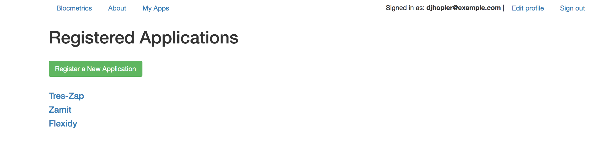
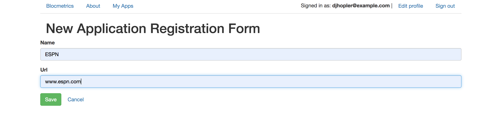
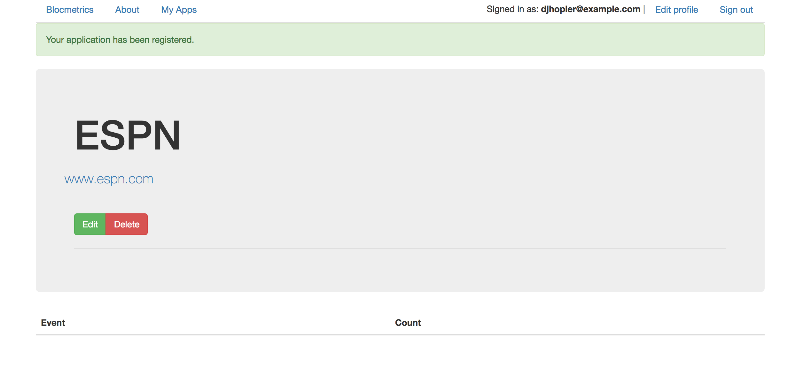
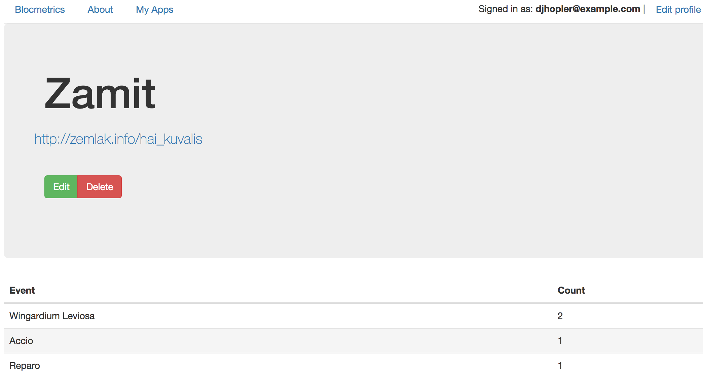
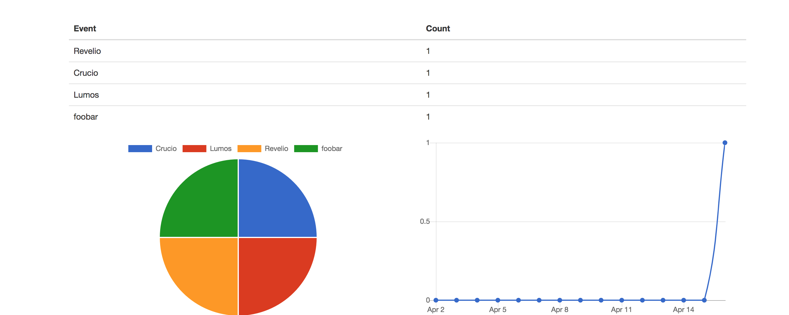

# Blocmetrics

An analytics app that users can use with their apps to track user activity.
* Key features:
	* A client-side JavaScript snippet that allows a user to track events on their website.
	* A server-side API that captures and saves those events to a database.
	* A Rails application that displays the captured event data for a user.

#### Dependecies and Configuration

* Rails 5.2.2
* Ruby 2.6.0
* [Chartkick](https://github.com/ankane/chartkick#installation) - gem for creating JavaScript charts
* [Groupdate](https://github.com/ankane/groupdate) - gem used to create line chart of events over time
* Database initialization - PostgreSQL
* Test suite - rspec-rails', '~> 3.8'
* seed data - Faker gem

#### Deployment
* Deployed using Heroku

#### Tracking App Events
Add the below Javascript snippet to the apps you want to track events in: <br/>

```
var blocmetrics = {};

	blocmetrics.report = function(eventName) {
	   // #1
	   var event = {event: { name: eventName }};

	   // #2
	   var request = new XMLHttpRequest();
	   // #3
	   request.open("POST", "http://localhost:3000/api/events", true);
	   // #4
	   request.setRequestHeader('Content-Type', 'application/json');
	   // #5
	   request.send(JSON.stringify(event));
	}

```
- place the snippet above in your app : _app/assets/javascripts/application.js_

## Using Blocmetrics

#### User Sign-up and App Registration
* Use `Devise` gem for user signup. Register your applications you wish to track using `name` and `url` attributes.

* For info on implementing Devise in your app [click here!](https://github.com/plataformatec/devise)

#### Register a new app with Blocmetrics for Tracking






#### Store Events in Blocmetrics received from registered application


#### Use API Controller and Routes to receive incoming events
* create events_controller and edit routes for API
* test with curl:

```
curl -v -H "Accept: application/json" -H "Origin: <Your Registered App Here>" -H "Content-Type: application/json" -X POST -d '{"name":"<Your Event Here>"}'  http://localhost:3000/api/events

```

#### Use Chartkick and Groupdate to provide Event Graphs
* Display in registered_application/show.html.erb


